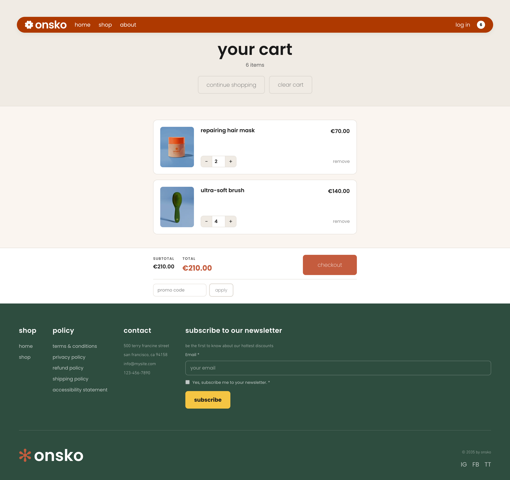

# Jay Wix Onsko Store Template

A Wix Stores template using the [Jay Framework](https://github.com/jay-framework/jay) and Wix Headless. Features animated homepage, product listing, product detail pages, and a shopping cart.

**Live demo:** [jay-onsko-52654f57-yoav68.wix-site-host.com](https://jay-onsko-52654f57-yoav68.wix-site-host.com)

<p>
  
  
  
  
</p>

## Prerequisites

- Node.js >= 20
- A Wix site with Wix Stores installed

## 1. Setup

```bash
npm install
npx @wix/cli login
npm create @wix/new@latest init
npm run setup
```

Here's what each command does:

1. **`npm install`** — Installs project dependencies.

2. **`npx @wix/cli login`** — Authenticates the Wix CLI with your Wix account. Required before connecting this project to Wix and before deploying to Wix BaaS. Opens a browser window to complete sign-in.

3. **`npm create @wix/new@latest init`** — Provisions a headless Wix site for this project and writes `wix.config.json` with:
   - `siteId` — the Wix site identifier (also known as metasite ID in Wix)
   - `appId` — a client ID for headless API access

   This command is only required for Wix-hosted sites. It must be run while logged in to Wix CLI.

4. **`npm run setup`** — Creates `config/.wix.yaml`. If a valid `wix.config.json` exists, it reads the `siteId` and `clientId` from it.

   > **Note:** `appId` (in `wix.config.json`) and `clientId` (in `config/.wix.yaml`) are the same value. Both can also be generated manually from **Wix Dashboard → Site Settings → Headless Settings → Headless Client**.

5. **Generate an API key** — Go to **Wix Dashboard → Account Settings → API Keys**, create a new key, and paste it into `config/.wix.yaml` under `apiKeyStrategy.apiKey`.

6. **Install Wix Stores** — In the **Wix Business Manager → Apps → Manage Apps → App Market**, find **Wix Stores** and add it to the site.

7. **Create the `jay-backend-files` collection** — In the **Wix Business Manager** of the same site (or the site referenced in `config/.wix.yaml`, if those are different), go to **CMS** and create a new collection named **`jay-backend-files`**. No specific schema is required. This collection stores pre-compiled page data for Wix BaaS deployment.

8. **Run `npm run setup` again** to validate that all credentials are configured correctly.

When everything is set up, the output should look like:

```
📦 wix-server-client
   ✅ Services verified
   Wix client connected (site: 04cf42a4...)

📦 wix-deploy
   ✅ Services verified
   Deploy target: wix.config.json (appId: 574c2287...). Collection: jay-backend-files ✓

📦 wix-stores
   ✅ Services verified
   Wix Stores configured (product URL: /products/{slug})

Setup complete: 3 configured
```

### Why two credential files?

| File               | Purpose                                                                                                                             |
|--------------------|-------------------------------------------------------------------------------------------------------------------------------------|
| `wix.config.json`  | Used for **Wix BaaS deployment** — only needed on the server where the application is deployed. Required only for Wix-hosted sites. |
| `config/.wix.yaml` | Used to **connect to Wix backend** services (Wix Data, Wix Stores, etc.) at build time and runtime.                                 |

Having two separate files allows deploying multiple versions of the business as different BaaS instances. By default, both point to the same site.

## 2. Generate Agent Kit

```bash
npm run agent-kit
```

Generates an `agent-kit/` directory with documentation and reference material for the AI agent. The kit is organized by role:

```
agent-kit/
├── plugins-index.yaml              # Index of all installed plugins, their contracts, actions, services, and contexts
├── designer/                       # Jay-HTML syntax, styling, components, and routing for visual design
├── developer/                      # Page contracts, component data/state/refs, CLI commands, and configuration
├── devops/                         # Production builds, serving modes, fetch handler, and cache invalidation
├── plugin/                         # Plugin structure, actions, commands, services, webhooks, and validation
├── materialized-contracts/
│   └── wix-stores/
│       └── product-page.jay-contract   # Fully resolved product page contract with all fields
└── references/
    └── wix-stores/
        └── categories.yaml         # Store categories reference data
```

Each role directory includes an `INSTRUCTIONS.md` entry point for the AI agent.

## 3. Dev Server

```bash
npm run dev
```

The dev server starts at `http://localhost:3000` with hot reload. If port 3000 is taken, it will pick another port and print the URL in the output.

## 4. AI Designer (Aiditor)

The project includes the Jay AI designer for editing pages visually with AI assistance.

```bash
npm run dev
```

Then open `http://localhost:3000/aiditor` in your browser.


1. **Navigate between pages** using the site itself within the preview, or using the top routes selector dropdown.
2. **Annotate visually** using the point, area, or arrow tools to give visual instructions to the agent. You can also paste images into the annotation instructions.
3. **Use the bottom Agent Output panel** to see progress and give textual instructions via Claude Code.

## 5. Deploy to Wix BaaS

This project includes the `wix-deploy` package for deploying to Wix BaaS. If you don't need Wix deployment, remove `wix-deploy` from your dependencies.

Make sure you're logged in to Wix CLI (`npx @wix/cli login`) before deploying.

```bash
npm run build:production
npm run deploy
```

This bundles a 2.5 MB `entry.mjs`, uploads page data to the `jay-backend-files` collection, and deploys the server + frontend to Wix BaaS + CDN.

## 6. Deploy to Self-Hosted Server

```bash
# Build
npm run build:production

# Serve with the built-in production server
npm run serve
```

Or use the fetch handler directly in any Node.js server:

```typescript
import { createJayFetchHandler } from '@jay-framework/jay-fetch-handler';

const handler = createJayFetchHandler({
  backendDir: './build/v0.18.0/backend',
  staticBaseUrl: '/',
  frontendDir: './build/v0.18.0/frontend',
});

// Use with any HTTP server framework
```

## Project Structure

```
src/
├── pages/
│   ├── page.jay-html                    # Homepage
│   ├── products/
│   │   ├── page.jay-html                # Product listing
│   │   ├── [slug]/page.jay-html         # Product detail (dynamic)
│   │   └── ceramic-flower-vase/         # Product detail (static override)
│   │       └── page.jay-html
│   └── cart/
│       └── page.jay-html                # Shopping cart
└── styles/
    └── atelier-theme.css                # Theme styles
```

Pages use `.jay-html` templates with headless component bindings — no JavaScript needed for data fetching, SSR, or client hydration. The framework handles all of that through contracts and plugins.

